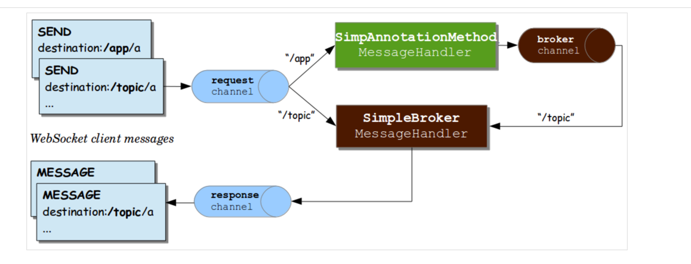

[참고한 링크](https://ratseno.tistory.com/71)

## WebSocketConfig.java

### STOMP

- Simple Text Oriented Messaging Protocol
- 말그대로 프로토콜, 웹 소켓에서 사용하는 프로토콜인 듯
- 이걸로 특정 사용자에게 메세지를 보내는 방법, 특정 주제를 구독한 사용자에게만 메세지를 보내는 방법을 정의한단다.

### configureMessageBroker() 메서드

- 메세지 브로커?(한 클라이언트에서 다른 클라이언트로 메세지를 라우팅 할때 사용?)
- 메세지 브로커는 특정 주제를 구독한 연결된 모든 클라이언트에게 메세지를 브로드캐스트한다.
- RabbitMQ, ActiveMQ와 같은 다른 모든 기능을 갖춘 메세지 브로커를 자유롭게 사용할 수 있단다.
- "/app", "/topic" 을 정의. 메세지 핸들링 메소드? 메세지 브로커?
- 나머지 코드 참조

## ChatController.java

- /chat.sendMessage, /chat.addUser를 정의
- 뭐 /app/chat.sendMessage 이러면 
    - @MessageMapping이 달린 걸로 라우팅 된단다.
    - > 그럼 위에 메세지 핸들링 메소드란 말이 @MessageMapping 인 갑네

- event listner를 이용해 소켓 연결, 그리고 소켓 연결 끊기 이벤트를 수신해
사용자가 이벤트에 참여거나 떠날ㄷ 때 이벤트를 로깅, 브로드캐스팅 할 수 있다.

## WebSocketEventListener.java

- @EventListener
  - Spring 4.2 부터 뭐 ApplicationListener 안 쓰고 이거 쓰면 된단다
  - 먼소리야... 나중에 공부 좀 해야할 듯
  - [밸덩 스프링 이벤트 관련 링크](https://www.baeldung.com/spring-events)

## main.js의 connect()

- /ws 로 커넥트를 보내는 듯

## [좀 더 설명 잘된 거 보고 공부](https://supawer0728.github.io/2018/03/30/spring-websocket/)

- [D2 : polling vs streaming ... 등](https://d2.naver.com/helloworld/1052)
- [스프링 레퍼런스 STOMP 설명 + WebSocket](https://docs.spring.io/spring/docs/5.0.4.RELEASE/spring-framework-reference/web.html#websocket-stomp-message-flow)

은근 어렵네